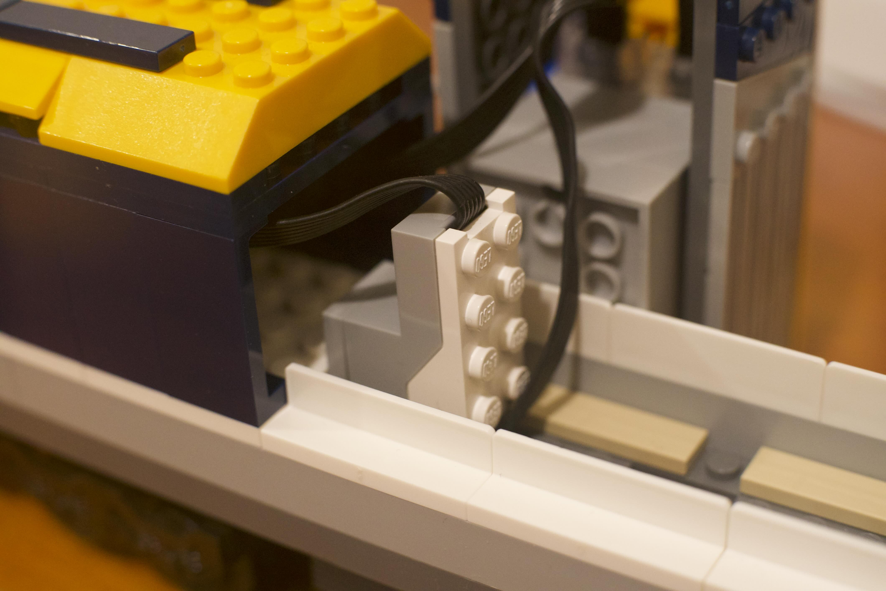
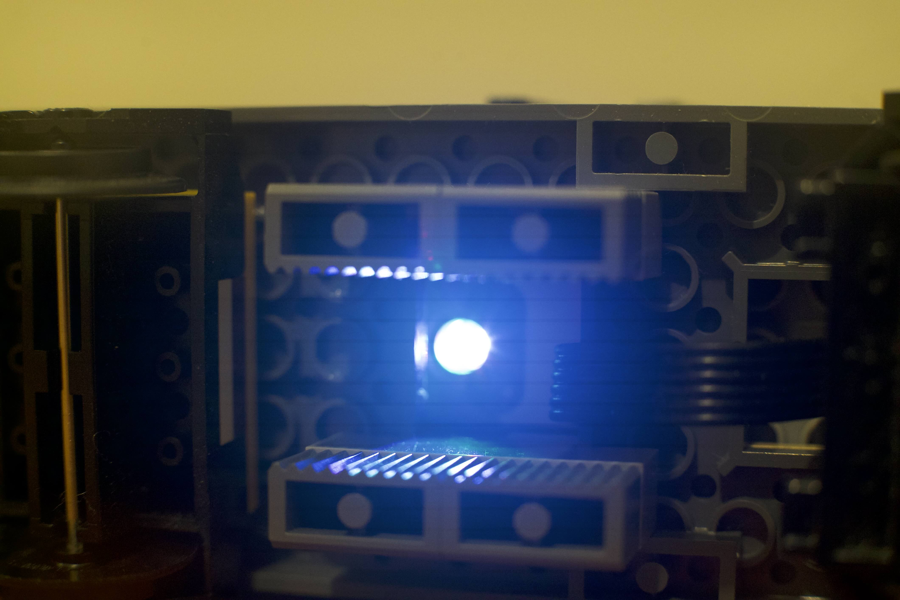

# legotrain
Python scripts to automate Lego City trains

This package depends on https://github.com/undera/pylgbst 

Example of computer control using this software. The entire sequence is done 
with hands off, although the handset controller remains fully functional and
available for the user to modify the train's default behavior
https://www.youtube.com/watch?v=AUTcSPW_DJ4

## Design

In the configuration currently implemented, two trains equipped with
vision sensors (LEGO® Powered Up 88007 Color & Distance Sensor) 
run on a simple (topologically) circular track equipped with two lateral 
branches that act as train stations, each one dedicated to its own 
train. The trains run against each other, and the software takes care 
of preventing collisions by ensuring that they can only cross each 
other when one is parked on its own station. Switches that connect the 
station branches with the main line are fixed, effectively creating a unique
and distinct path for each train, although the paths overlap each other for
most of the track length.

The vision sensors are mounted in the train engine, pointing down throughout 
an opening in the structural main plate. The sensors are used to detect color 
tiles on the track.

#### Vision sensor mounted on 60197 train engine

| </img> |
  </img> |

### Trains

Each train in the system is represented by an instance of a subclass of 
_Train_. The specific subclass capable of handling the vision sensor is
_SmartTrain_. The corresponding module _train.py_ contains class definitions 
for these, as well as for auxiliary objects that are used to control the 
train's motors, their LED headlights (when so equipped), their hub's LED color 
light, report battery status, and handle events from vision sensors.

Other classes exist to handle a simple train with no vision sensor, but which
can optionally have LED headlights (_SimpleTrain_), and a composite train made
by linking back-to-back two engines, with all cars in between (_CompoundTrain_). 
In this composite train, the front engine is represented by an instance of 
_SimpleTrain_ equipped with LED headlights, and the rear engine is represented
by an instance of _SmartTrain_. The control software handles the details of
acceleration and braking with two engines working in reverse and with uneven 
battery voltages as well (see video with example).

Currentlly these special configurations may not work properly because most of the 
recent development work focused on the two-train configuration. 

### Track

The track for this initial project is topologically a simple circle with
two branches that are used as train stations. Each one serves one 
sensor-equipped train. The track is divided into segments; and the main goal of the
software is to ensure that each segment is occupied by mostly one, and only one,
train, at any given time. 

The simple track configuration described above can be divided into four segments;
two are associated with each one of the stations, and two segments laid out in between 
the stations and connecting them. Segments are marked by color tiles laid out on
the track at each segment end points, in such a way that a train, when moving over a color 
tile, will send a signal to the controlling script. That way, the script can know where 
the train is at that moment, and take actions accordingly. The station segments differ 
slightly from the above configuration, by having a single red tile marking the point 
where the train should stop when arriving at the station.

The segment classes and the track layout are defined in module _track.py_. There are 
two kinds of segments, a plain, and a structured segment. The structured segment has
two sub-segments inside it, named 'fast' and 'slow'. The transition between them is 
marked by a color tile of the same color used to mark the segment end points. The purpose
of the sub-segments is to allow the train to know where it is inside the segment, giving
it enough time to interrogate the next segment about its occupancy status, allowing it to
prepare in advance of arriving at the inter-segment transition region. Plain segments can
be used when no such advanced preparation is necesssary (as, for instance, when the next
segment in the track layout is a station segment where a mandatory stop has to take
place anyway).

The track layout is defined by a static data structure made of nested dictionaries. Two
track layouts are actually necessary, since the layout may look different for trains 
running in clockwise and counter-clockwise directions.

### Controller

The _Controller_ class is responsible for establishing the connections in between the
class instances that are passed to it by the _main.py_ module. It also creates an
instance of class _RemoteHandset_ that handles user input from the handset, and connects
handset gestures to functions in the code.

_Controller_ can handle a number of different train configurations. Examples of these 
can be found in the _main.py_ module. The main module is the one that runs under the
main thread in Python, thus it is the module that also sets up and maintains the 
tkinter GUI.

#### Handset gestures

Each set of buttons in the handset (left and right) controls one of the trains with the
same gestures found by default in the Lego train set as it comes out of the box: plus 
key increases train speed, minus key decreases train speed, red key stops the train. 

Two additional gestures are accepted as well: 

- pressing and holding for 1 sec or more any one of the red keys will stop both trains 
and reset the entire system to manual mode. This means that the trains can only move 
now under command of the handset left and right button sets, and they won't see the 
track color marks any longer. This is useful to retrieve the trains from any undesired 
situation and move each one to its own station. They can only be properly restarted in 
automatic mode when are in this configuration.
- momentarily pressing both red keys simultaneously will start both trains in auto mode.
They will hold at each station for a certain time (randomly chosen) and then start
moving in automatic mode.

### Vision sensors

The 88007 sensors can have trouble in telling apart many of the colors available in LEGO 
bricks. I conducted many experiments with a variety of colors in order to select 
particular combinations that would work for this project. Software used for these 
experiments is in directory _test_.

The train control software uses color hue (H) and saturation (S) on the HSV color 
space to uniquely identify colors. So far, I found just three colors that are well 
separated from each other in the CIE (Commission Internationale de l'Eclairage) 
standard normalized HSV diagram: Bright Red (SKU: 4560179), Dark Azur (SKU: 6206312), 
and Vibrant Yellow (SKU: 6432185). Other colors tend to overlap partially with these 
"best" colors, hindering the ability to correctly identify them. The yellows are 
particularly tricky to be correctly picked out by the sensors, since they may apparently 
contain a significant red component (invisible to our eyes but visible to the sensors), 
they have lower saturation values, and they get easily confused with the light-yellowish 
carpet under the track. 

Even with these "best" colors, the sensors generate a still significant number of 
false positive and false negative detections. I believe they are caused in part by 
interference with ambient light, confusion with the track sleepers and carpet 
underneath the track, and sensor sampling resolution. The software has a number of 
ways of, at least partially, handling these false detections by relying on timing 
information as the train moves along the track. 

