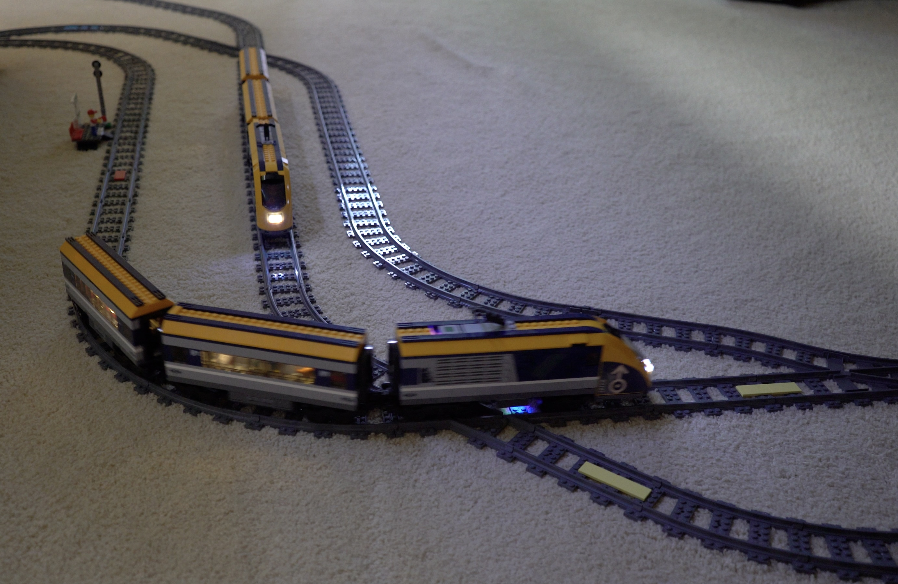
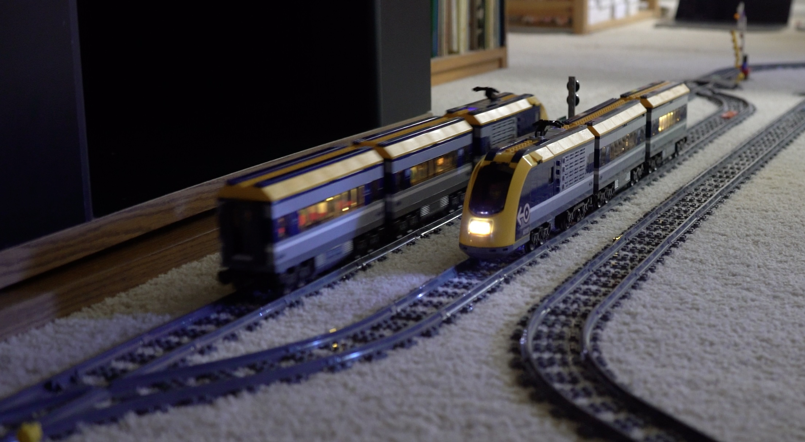
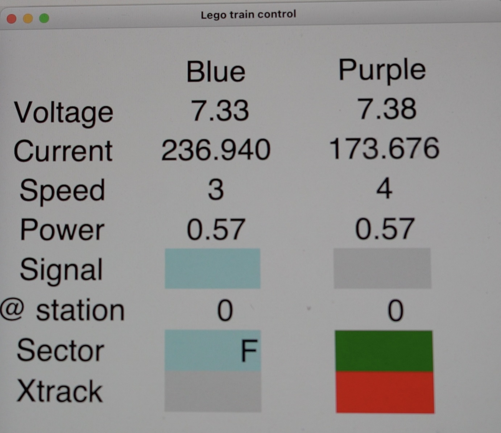
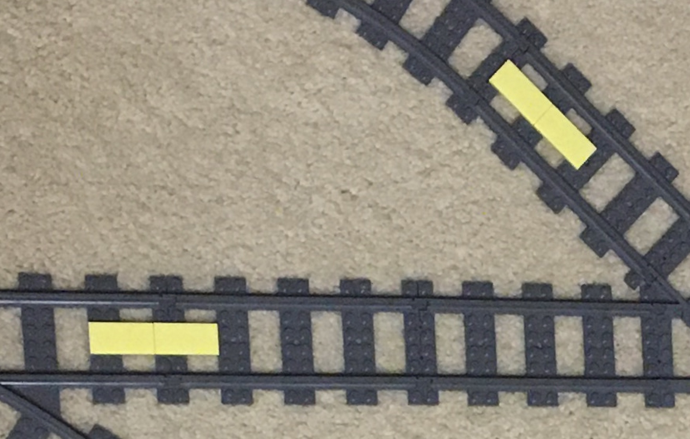
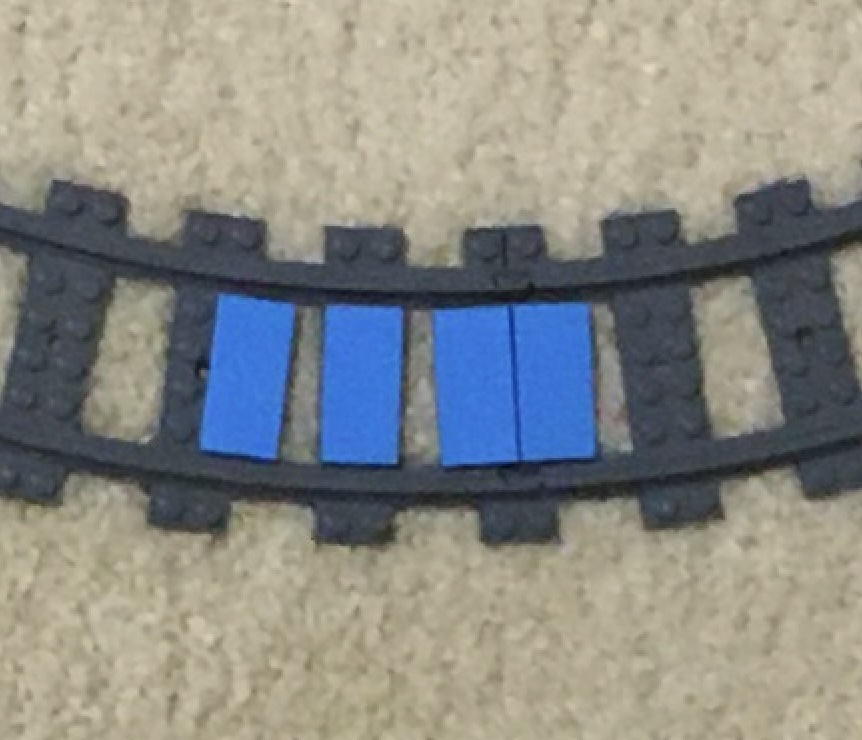

# legotrain

Python scripts to automate LEGO® City trains.

For the Powered Up Bluetooth-based LEGO® remote control system.

## Functional examples

These trains are running entirely under computer control, without 
any manual intervention. Once started, the Python control script
takes care of accelerations and decelerations, stopping at stations,
and detecting conflicting situations at the track crossings and at
common stretches of track as well. The handheld control remains 
available for the user to bypass the control script if she wishes.

Two trains sharing one track with crossings:

</img>

Video: https://youtu.be/4O-srwudk8o

</img>

Video: https://youtu.be/ZrPOPnYgCn0

Composite train with two engines:

</img>

Video: https://www.youtube.com/watch?v=AUTcSPW_DJ4

## Requirements and installation

This is *not* a plug-and-play software distribution. In order to use it,
you should install from the source code. You should be familiar with
Python installation procedures and environment set up, as well as have at 
least cursory familiarity with *git* and GitHub. 

This is so because the software very likely will have to be tuned to your
specific train setup. Most of this tuning can be performed by editing a few
parameters in the source code. If you are familiar with Python development and
OO design principles, you should be able to even modify the code itself, once 
you get familiar with it, in order to better adjust some of the algorithms 
to you specific needs. 

Thus, familiarity with a good Python IDE, as well as some experience in using
GitHub resources such as forking and branching, would greatly enhance your
experience (and fun) with the software.

The basic dependence is with package  https://github.com/undera/pylgbst 
It in turn will require installation of a Python Bluetooth library that
 are available as well. See the documentation at the  *pylgbst* repo for
further details.

My installation runs under Python 3.10 on a MacBook M1 Pro with Sonoma 14.2. 

A very basic real-time screen output based on Tkinter displays status information.
Mostly useful for development and diagnosing "train accidents".

</img>

Video: https://youtu.be/pJlqUa_otJE

## Design

In the configuration currently implemented, two trains equipped with
vision sensors (LEGO® Powered Up 88007 Color & Distance Sensor) 
run on a simple (topologically) circular track equipped with two passing 
loops that act as train stations, each one dedicated to its own 
train. The trains run against each other, and the software takes care 
of preventing collisions by ensuring that they can only cross each 
other when one is parked on its own station. Switches that connect the 
station loops to the main line are fixed, effectively creating a unique
and distinct path for each train. Although the paths overlap each other for
most of the track length.

### Trains

Each train in the system is represented by an instance of a subclass of 
_Train_. The specific subclass capable of handling the vision sensor is
_SmartTrain_. The corresponding module _train.py_ contains class definitions 
for these, as well as for auxiliary objects that are used to control the 
train's motors, their LED headlights (when so equipped), their hub's LED color 
light (see below), report battery status, and handle events from vision sensors.

Other classes exist to handle a simple train with no vision sensor, but which
can optionally have LED headlights (_SimpleTrain_), and a composite train made
by linking back-to-back two engines, with all cars in between (_CompoundTrain_). 
In this composite train, the front engine is represented by an instance of 
_SimpleTrain_ equipped with LED headlights, and the rear engine is represented
by an instance of _SmartTrain_. The control software handles the details of
acceleration and braking with two engines working in reverse and with uneven 
battery voltages as well (see video with example).

Currentlly these special configurations may not work properly because most of the 
recent development work focused on the two-train configuration. 

#### Color LED signals

The train hub LED is used to convey status information about the train. The 
implemented signals are:

- **solid color** - this is the color used when calling the constructor for the particular
_Train_ subclass. It is used to identify the train. When the train is moving and its
status is normal, that is the color it displays.
- **blinking** between the train color and orange - this signals that the train is stopped
and waiting for control inputs, either from the control script or the handset.
- **green** - the train received a start command from the control script and is free to 
move (simulates the train engineer seeing a green light).
- **red** - the train received a start command from the control script but is not free
to move (simulates the train engineer seeing a red light)

### Track

The track for this initial project is topologically a simple circle with
two passing loops that are used as train stations. Each one serves one 
sensor-equipped train. The track is divided into sectors; and the main goal of the
software is to ensure that each sector is occupied by mostly one, and only one,
train, at any given time. 

The simple track configuration described above can be divided into four sectors;
two are associated with each one of the stations, and two sectors laid out in between 
the stations and connecting them. Sectors are marked by color tiles laid out on
the track at each sectors end points, in such a way that a train, when moving over a color 
tile, will send a signal to the controlling script. That way, the script can know where 
the train is at that moment, and take actions accordingly. The station sectors differ 
slightly from the above configuration, by having a red tile marking the point 
where the train should stop when arriving at the station.

The sector classes and the track layout are defined in module _track.py_. There are 
two kinds of sectors, a plain, and a structured sector (station sectors are basically
plain sectors). The structured sector has
two sub-sectors inside it, named 'fast' and 'slow'. The transition between them is 
marked by a color tile of the same color used to mark the sector's end points. The purpose
of the sub-sectors is to allow the train to know where it is inside the sector, giving
it enough time to interrogate the next sector about its occupancy status, allowing it to
prepare in advance of arriving at the inter-sector transition region. Plain sectors can
be used when no such advanced preparation is necessary (as, for instance, when the next
sector in the track layout is a station sector where a mandatory stop has to take
place anyway).

The track layout is defined by a static data structure made of nested dictionaries. Two
track layouts are actually necessary, since the layout may look different for trains 
running in different directions.

This picture shows one among many possible physical realizations of the current track 
layout. Note the blue tiles marking a structured sector. The actual positioning of the 
color tiles must account at least in part for train inertia when stopping or changing 
speed. This kind of effect is already partially handled by the control software. Since 
train inertia depends on the number of cars, the train instances are initialized with 
the number of cars in the train, enabling the software to approximately account for train
mass when computing the acceleration and braking voltage ramps. This is all a consequence 
of the train motors being DC motors and not step motors as in other LEGO® robotic components.

</img>

### Controller

The _Controller_ class is responsible for establishing the connections in between the
train class instances that are passed to it by the _main.py_ module, and the handset. 
It also creates an instance of class _RemoteHandset_ that handles user input from the 
handset, and connects handset gestures to functions in the code.

_Controller_ can handle a number of different train configurations. Examples of these 
can be found in the _main.py_ module. The main module is the one that runs under the
main thread in Python, thus it is the module that also sets up and starts the tkinter GUI.

#### Handset gestures

Each set of buttons in the handset (left and right) controls one of the trains with the
same gestures found by default in the LEGO® train set as it comes out of the box: 

- plus key - increases train speed
- minus key - decreases train speed
- red key - stops the train

Two additional gestures are accepted as well: 

- pressing and holding for 1 sec or more any one of the red keys, upon key release will 
stop both trains and reset the entire system to manual mode. This means that the trains 
can only move now under command of the handset left and right button sets, and they will 
ignore the track color signals. This is useful to retrieve the trains from any undesired 
situation and move each one back to its own station. They can only be properly restarted in 
automatic mode when are in this configuration.
- momentarily pressing both red keys simultaneously will start both trains in auto mode.
They will hold at each station for a certain time (randomly chosen) and then start
moving in automatic mode.

The system was envisioned to support the manual input of speed and stop commands from
the user even when in automatic mode. This functionality wasn't extensively tested yet
though, so one may expect problems when manually interfering with the trains running 
in auto mode.

### Vision sensors

The vision sensors are mounted in the train engines, sticking throughout an opening in the 
structural main plate. The sensors are used to detect color tiles on the tracks as the train 
moves over them. 

Make sure you mount the sensors in the same way as in the pictures below. They should protrude 
below the main plate so the sensor heads stays close to the color tiles on the track. Mounting 
them fully recessed inside the train decreases their sensitivity and signal-to-noise ratio by a 
significant amount, rendering color signal detection very unreliable.

Vision sensors should be connected to Port B on the Powered Up hub.

#### Vision sensor mounted on 60197 train engine

| </img> |
  </img> |
  </img> |

This video by [BrickGuy](https://www.youtube.com/@brickguy) shows how to do it: 

https://www.youtube.com/watch?v=S83go28JEiU

I conducted experiments with a variety of tile colors in order to select particular combinations 
that would work best for this project. Software used for these experiments can be found in 
directory _test_.

The train control software uses color hue (H), saturation (S), and value (V, also known as intensity
or brightness) on the HSV coordinate space to uniquely identify colors. Using the CIE (Commission 
Internationale de l'Eclairage) standard normalized HSV diagram (See [here](docs/Colorimetry.md) 
results from colorimetry analysis), I found a few tile colors that present adequate separation 
from each other: 

- Used in current configuration
  - Bright Red
  - Dark Green
  - Dark Azur
  - Bright Yellow
- Currently not used
  - Medium Azur
  - Vibrant Yellow (appears as bluish to some eyes) 
  - Bright Redish Violet

Colors that tend to partially overlap with each other, or sit close by, on the diagram, are 
unsuitable for reliable detection. We should also strive for colors with higher saturation S, 
and especially with higher values of brightness V. For instance, in the case of my installation over 
a light cream color carpet, it is possible to very reliably reject sensor readings coming from the 
dark gray track (low V) and from the carpet (low S). Users should adjust the software parameters 
(in file _src/signal.py_) to their own particular situations.

Even with these "best" colors, the sensors may eventually generate false positive or false 
negative detections. I believe they are caused in part by interference with ambient light, and 
sensor sampling resolution. The software has a number of ways of, at least partially, handling 
these false detections by relying on timing information as the train moves along the track. A 
few parameters associated with timing controls can be found in file _src/track.py_, but are also 
interspersed in the code itself (this is work in progress!).

#### Signal tile placement on the track

Tile placement and size can be somewhat tricky under some circumstances. 

Failed detections often result from a fast-moving train passing over a too short tile. This 
is caused by dead time in the vision sensor readout pattern. This dead time is necessary in order 
to prevent the vision sensor output stream to overwhelm the BLE channel bandpass. 

This situation can be remedied by using more than one tile:

</img>

One should avoid placing signal tiles over curved stretches of track. The curve causes the
vision sensor to misalign slightly from the track center line, thus causing failed detections. 
Sometimes, mounting multiple tiles cross-wise over the sleepers can fix that.

</img>

Note that the software contains a feature that causes the vision sensor to "go blind" just
after it had a positive detection of a signal tile. This was implemented as a way to minimize
false positive detections that may be generated by long sequences of tiles as shown above. The
blindness is just for the one color that was just detected, and lasts for a time that is 
user-definable (TIME_BLIND in <i>track.py</i>)

