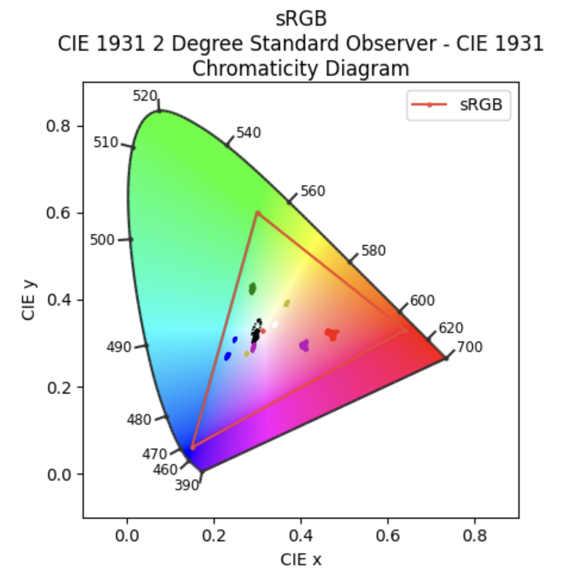
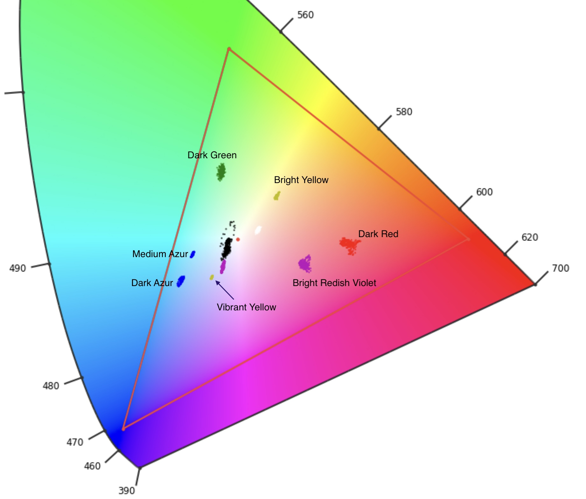

# Colorimetry analysis

Vision sensor calibration can be optimally achieved using the CIE 1931 _xy_ chromaticity
diagram. [This article](https://en.wikipedia.org/wiki/CIE_1931_color_space)
presents an excellent basic discussion on the diagram and its role in color science.

In the chromaticity diagram, and for this particular application, we strive for 
colors that lie the furthest away from each other (in the _xy_ space) as possible. 

The top diagram shows the entire CIE _xy_ color space. The colored region represents the
entire gamut of colors perceived by a "standard human observer" (see note **1**) The data 
points were obtained from each LEGO® tile color. The bottom diagram is a blow-up of the 
central part, with each LEGO® color name next to the cloud of points that correspond to a
given tile color. Data sets for each tile color are in directory _test/data_.

By plotting the data points on this diagram, we are in a way comparing the sensor's "eye" 
color response with the human eye's. 

These points were obtained by scanning the tiles with the script in
_src/vision_sensor_analysis.py_. Each data set comprises 600 sensor readings.
The data sets also include readings taken from the track sleepers (black data
points), as well as from the carpet that underlies the track (white data points). 

The _src/vision_sensor_analysis.py_ script also computes basic statistics for each sample 
taken; these stats were used as the basis for populating the HUE and SATURATION 
dictionaries in _src/signal.py_. To use tile colors not included in here, one can always 
run the script to collect data from other tile colors and expand the dictionaries with 
new entries. Of course, the code itself that uses this dictionary (in _src/event.py) will
have to be upgraded to handle the new colors (presumably associated with new 
functionality and/or new logic). 

</img>

</img>

(these diagrams were created with a Jupyter notebook, in file 
_test/Sensor_chromaticity_analysis.ipynb_)

## Notes

(**1**) The triangle represents the [_sRGB_](https://en.wikipedia.org/wiki/SRGB#:~:text=sRGB%20is%20a%20standard%20RGB,%2D2%2D1%3A1999.)
color space, which describes the entire gamut of colors representable with fidelity
by typical color devices used in consumer-level computers (displays, printers, smartphones,
tablets, etc). This means that the colors you are seeing outside the triangle are not 
represented correctly by your display. They "exist in nature", so to speak, because they
can be seen by our eyes. Some are representable by certain high-end digital devices, 
but can only be approximately represented by most computer displays.

